# GitHub Workflows Documentation

This directory contains automated workflows that help maintain code quality, security, and streamline the development process for the Market Data Collector project.

## 📋 Workflows Overview

### Build and Release Workflows

#### 1. **Build and Release** (`dotnet-desktop.yml`)
- **Trigger**: Manual workflow dispatch
- **Purpose**: Builds, tests, and publishes multi-platform releases on demand
- **Features**:
  - Builds on Ubuntu with .NET 9.0
  - Runs the full test suite
  - Multi-platform publishing (Linux, Windows, macOS x64/ARM64)
  - Prepares artifacts for release distribution

#### 2. **Pull Request Checks** (`pr-checks.yml`)
- **Trigger**: Pull requests to `main` or `develop`
- **Purpose**: Validates code quality before merging
- **Features**:
  - Code formatting verification (`dotnet format`)
  - Build validation
  - Test execution with code coverage
  - Coverage reports uploaded to Codecov
  - Combined status reporting

#### 3. **Docker Build & Publish** (`docker.yml`)
- **Trigger**: Manual workflow dispatch
- **Purpose**: Builds multi-arch Docker images and optionally pushes to GHCR
- **Features**:
  - Multi-platform builds (amd64, arm64)
  - Automatic tagging (latest, semver, sha)
  - Build cache optimization
  - Optional registry push based on input

#### 4. **Release Management** (`release.yml`)
- **Trigger**: Manual workflow dispatch
- **Purpose**: Streamlines creating new releases
- **Features**:
  - Semantic versioning validation
  - Automatic changelog generation
  - Git tag creation and push
  - GitHub release creation
  - Triggers build workflow automatically

#### 5. **Desktop App Build** (`desktop-app.yml`)
- **Trigger**: Manual workflow dispatch
- **Purpose**: Builds the Windows desktop app with generated assets
- **Features**:
  - Generates icons via Node.js tooling
  - Builds Windows desktop app for x64 and arm64
  - Uploads build artifacts for distribution

#### 6. **WPF Commands** (`wpf-commands.yml`)
- **Trigger**: Manual workflow dispatch
- **Purpose**: Executes restore, build, run, and self-contained publish commands for the WPF project
- **Features**:
  - Restores WPF project dependencies
  - Builds the WPF app in Release configuration
  - Runs the WPF app briefly to validate startup
  - Publishes a self-contained Windows build

### Code Quality and Security Workflows

#### 7. **Code Quality** (`code-quality.yml`)
- **Trigger**: Push/PRs that touch source, tests, or project files
- **Purpose**: Runs formatting, analyzers, and documentation checks in one pass
- **Features**:
  - Formatting verification
  - Analyzer-enabled build with documentation output
  - Summarized results in workflow summary

#### 8. **Dependency Review** (`dependency-review.yml`)
- **Trigger**: Pull requests to `main`
- **Purpose**: Blocks vulnerable or disallowed dependencies
- **Features**:
  - High-severity vulnerability gating
  - License deny list (GPL-2.0, GPL-3.0)
  - PR summary comments

#### 9. **Security Scan** (`security.yml`)
- **Trigger**: Pull requests to `main`, weekly schedule, manual dispatch
- **Purpose**: Multi-layered security scanning
- **Features**:
  - .NET package vulnerability checks
  - Secret detection with Gitleaks
  - SAST build analysis
  - CodeQL analysis on schedule or manual full scan

### Testing Workflows

#### 10. **Test Matrix** (`test-matrix.yml`)
- **Trigger**: Push/PRs that touch source or tests
- **Purpose**: Runs cross-platform tests with coverage reporting
- **Features**:
  - Linux tests on PRs
  - Windows/macOS tests on pushes to `main`
  - Coverage uploaded to Codecov

#### 11. **Nightly Testing** (`nightly.yml`)
- **Trigger**: Daily schedule, Manual dispatch
- **Purpose**: Comprehensive cross-platform testing
- **Features**:
  - Tests on Ubuntu, Windows, macOS
  - Runs benchmark suite
  - Integration self-tests
  - Creates issue on failure
  - Multi-platform coverage reports

#### 12. **Benchmark Performance** (`benchmark.yml`)
- **Trigger**: Pull requests changing code, Manual dispatch
- **Purpose**: Performance regression detection
- **Features**:
  - Runs BenchmarkDotNet benchmarks
  - Compares PR vs base branch
  - Posts results as PR comment
  - Uploads detailed results as artifacts

### Documentation Workflows

#### 13. **Documentation & Workflow Automation** (`docs-comprehensive.yml`)
- **Trigger**: Push/PRs touching docs/workflows/source, weekly schedule (Mondays 3 AM UTC), manual dispatch
- **Purpose**: Centralized documentation quality checks, generated docs sync, and AI instruction synchronization
- **Features**:
  - Markdown linting and link validation for documentation quality
  - ADR inventory summary reporting
  - Regenerates structure/provider/workflow documentation artifacts
  - Regenerates project context doc when DocGenerator is available
  - Synchronizes repository structure sections in `CLAUDE.md`, Copilot instructions, and documentation agent guidance
  - Supports dry-run and optional PR creation in manual runs
  - Publishes a single consolidated run summary for docs + workflow automation

### Automation and Maintenance Workflows

#### 17. **Auto Label PRs** (`labeling.yml`)
- **Trigger**: PR opened, edited, synchronized, reopened
- **Purpose**: Automatically categorizes pull requests
- **Features**:
  - File-based labeling (area labels)
  - Size-based labeling (xs/s/m/l/xl)
  - Warns about large PRs
  - Uses `.github/labeler.yml` configuration

#### 18. **Manage Stale Issues and PRs** (`stale.yml`)
- **Trigger**: Daily at midnight UTC, Manual dispatch
- **Purpose**: Keeps issue tracker clean
- **Features**:
  - Marks issues stale after 60 days
  - Closes stale issues after 7 more days
  - Marks PRs stale after 45 days
  - Closes stale PRs after 14 more days
  - Exempts pinned, security, and WIP items

#### 19. **Cache Management** (`cache-management.yml`)
- **Trigger**: Weekly (Sundays 4 AM UTC), Manual dispatch
- **Purpose**: Manages GitHub Actions cache
- **Features**:
  - Lists all caches
  - Cleans caches older than 30 days
  - Manual option to clean all caches
  - Helps manage storage limits

#### 20. **Scheduled Maintenance** (`scheduled-maintenance.yml`)
- **Trigger**: Weekly schedule, Manual dispatch
- **Purpose**: Runs periodic tests and dependency health checks
- **Features**:
  - Weekly full test suite
  - Dependency health report (outdated, deprecated, vulnerable)
  - Summary report output

#### 21. **Build Observability** (`build-observability.yml`)
- **Trigger**: Manual workflow dispatch
- **Purpose**: Generates build diagnostics and observability bundles
- **Features**:
  - Runs build diagnostics targets
  - Collects build fingerprints and metrics
  - Uploads debug artifacts

#### 22. **Workflow Validation** (`validate-workflows.yml`)
- **Trigger**: Pull requests touching workflows or manual dispatch
- **Purpose**: Validates workflow syntax and checks reusable references
- **Features**:
  - Ensures workflow YAML consistency
  - Validates issue template YAML files
  - Validates AI assistant prompt YAML files
  - Catches invalid reusable workflow usage
  - Fast feedback for workflow edits

#### 23. **Reusable Build Helpers** (`reusable-dotnet-build.yml`)
- **Trigger**: Reusable workflow (called by other workflows)
- **Purpose**: Standardizes build/test steps for .NET jobs
- **Features**:
  - Shared build/test steps
  - Consistent caching and restore behavior

## 🔧 Configuration Files

### Dependabot Configuration (`dependabot.yml`)
Automated dependency updates for:
- **NuGet packages**: Weekly on Mondays
- **GitHub Actions**: Weekly on Mondays
- **Docker base images**: Weekly on Mondays

Groups minor and patch updates together to reduce PR noise.

### Auto-Labeler Configuration (`labeler.yml`)
Defines patterns for automatic labeling:
- **Area labels**: `area: core`, `area: providers`, `area: storage`, etc.
- **Type labels**: `documentation`, `tests`, `infrastructure`, etc.
- **Special categories**: Security-related changes

### Documentation Checking
- **`markdown-link-check-config.json`**: Configures link validation
- **`spellcheck-config.yml`**: Spell-checking configuration

## 📝 Issue Templates

### Bug Report (`ISSUE_TEMPLATE/bug_report.yml`)
Structured form for reporting bugs with fields for:
- Description and reproduction steps
- Expected vs actual behavior
- Version and OS information
- Data provider context
- Logs and configuration

### Feature Request (`ISSUE_TEMPLATE/feature_request.yml`)
Structured form for suggesting features:
- Problem statement
- Proposed solution and alternatives
- Feature area and priority
- Use case description

### Configuration (`ISSUE_TEMPLATE/config.yml`)
- Disables blank issues
- Links to documentation and discussions

## 📄 Pull Request Template

**`PULL_REQUEST_TEMPLATE.md`**
Standard template requiring:
- Change description and type
- Motivation and testing details
- Comprehensive checklist
- Breaking changes documentation
- Related issue links

## 🚀 Usage Tips

### For Developers

1. **Before Opening a PR**:
   ```bash
   # Format code locally
   dotnet format MarketDataCollector.sln
   
   # Run tests
   dotnet test
   ```

2. **Triggering Workflows Manually**:
   - Go to Actions tab
   - Select workflow
   - Click "Run workflow"

3. **Understanding PR Status Checks**:
   - ✅ All checks must pass before merge
   - Review dependency review and security scan summaries
   - Check code coverage reports in Codecov uploads

### For Maintainers

1. **Creating a Release**:
   - Use "Release Management" workflow
   - Provide semantic version (e.g., `v1.6.0`)
   - Mark as pre-release if needed
   - Workflow handles tagging and triggering builds

2. **Security Monitoring**:
   - Check Security tab regularly
   - Review Dependabot PRs promptly
   - CodeQL runs on the weekly security schedule or manual full scans

3. **Managing Stale Items**:
   - Workflow runs automatically
   - Exempt important items with labels
   - Review and respond to stale warnings

## 🔒 Security Features

- **CodeQL**: Advanced security scanning with security-and-quality queries
- **Dependency Review**: Blocks PRs with vulnerable or prohibited dependencies
- **Package Audit**: Scans for vulnerable NuGet packages
- **Secret Detection**: Gitleaks scans for exposed credentials
- **SAST**: Analyzer-based security warnings during builds

## 📊 Metrics and Monitoring

- **Code Coverage**: Uploaded to Codecov on every PR and nightly
- **Benchmarks**: Performance tracking with historical comparison
- **Security Alerts**: Automated issue creation on nightly test failures
- **Artifact Retention**: 30 days for builds, benchmarks, and reports

## 🔄 Workflow Dependencies

```mermaid
graph TD
    PR[Pull Request] --> PRChecks[PR Checks]
    PR --> CodeQuality[Code Quality]
    PR --> DependencyReview[Dependency Review]
    PR --> Security[Security Scan]
    PR --> Docs[Documentation]
    PR --> AutoLabel[Auto Label]
    PR --> Validate[Validate Workflows]
    
    PRChecks --> Lint[Format Check]
    PRChecks --> Build[Build]
    PRChecks --> Test[Test + Coverage]
    
    Push[Push to Main] --> TestMatrix[Test Matrix]
    Push --> CodeQuality
    Push --> Docs
    
    Schedule[Scheduled] --> Nightly[Nightly Tests]
    Schedule --> Stale[Stale Management]
    Schedule --> Cache[Cache Cleanup]
    Schedule --> Maintenance[Scheduled Maintenance]
    
    Manual[Manual Dispatch] --> BuildRelease[Build and Release]
    Manual --> Docker[Docker Build]
    Manual --> Desktop[Desktop App Build]
    Manual --> Observability[Build Observability]
    Manual --> DocsAutomation[Docs & Workflow Automation]
    Manual --> Release[Release Workflow]
```



## 📚 Best Practices

1. **Keep workflows fast**: Use caching and parallel jobs
2. **Fail fast**: Critical checks should fail quickly
3. **Clear feedback**: Provide actionable error messages
4. **Security first**: All code changes go through multiple security scans
5. **Automated maintenance**: Let workflows handle routine tasks
6. **Documentation**: Keep this README updated with workflow changes

## 🛠️ Maintenance

### Adding a New Workflow

1. Create workflow file in `.github/workflows/`
2. Test with `workflow_dispatch` trigger first
3. Update this README with workflow documentation
4. Add to workflow dependencies diagram if applicable

### Modifying Existing Workflows

1. Test changes in a feature branch
2. Review workflow run logs for issues
3. Update documentation if behavior changes
4. Consider backward compatibility

### Debugging Workflows

1. Enable debug logging:
   ```yaml
   env:
     ACTIONS_RUNNER_DEBUG: true
     ACTIONS_STEP_DEBUG: true
   ```

2. Use workflow artifacts for debugging
3. Check workflow run logs in Actions tab
4. Test locally with `act` tool when possible

## 📞 Support

- **Issues**: Report workflow problems using bug report template
- **Documentation**: Refer to `.github/workflows/README.md` (this file)
- **GitHub Actions Docs**: https://docs.github.com/en/actions

---

**Last Updated**: 2026-02-05
**Maintained By**: Market Data Collector Team
