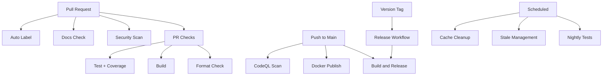

# GitHub Workflows Documentation

This directory contains automated workflows that help maintain code quality, security, and streamline the development process for the Market Data Collector project.

## 📋 Workflows Overview

### Build and Release Workflows

#### 1. **Build and Release** (`dotnet-desktop.yml`)
- **Trigger**: Push to `main`, Pull Requests, Git tags starting with `v*`
- **Purpose**: Main CI/CD pipeline that builds, tests, and publishes releases
- **Features**:
  - Builds on Ubuntu with .NET 9.0
  - Runs all tests with detailed logging
  - Multi-platform publishing (Linux, Windows, macOS x64/ARM64)
  - Creates GitHub releases for version tags
  - Generates single-file executables with trimming

#### 2. **Pull Request Checks** (`pr-checks.yml`)
- **Trigger**: Pull requests to `main` or `develop`
- **Purpose**: Validates code quality before merging
- **Features**:
  - Code formatting verification (`dotnet format`)
  - Build validation
  - Test execution with code coverage
  - Coverage reports uploaded to Codecov
  - Combined status reporting

#### 3. **Docker Publish** (`docker-publish.yml`)
- **Trigger**: Push to `main`, version tags, releases, manual dispatch
- **Purpose**: Builds and publishes Docker images to GitHub Container Registry
- **Features**:
  - Multi-platform builds (amd64, arm64)
  - Automatic tagging (latest, semver, sha)
  - Build cache optimization
  - Published to `ghcr.io`

#### 4. **Release Management** (`release.yml`)
- **Trigger**: Manual workflow dispatch
- **Purpose**: Streamlines creating new releases
- **Features**:
  - Semantic versioning validation
  - Automatic changelog generation
  - Git tag creation and push
  - GitHub release creation
  - Triggers build workflow automatically

### Code Quality Workflows

#### 5. **CodeQL Security Analysis** (`codeql.yml`)
- **Trigger**: Push to `main`, Pull Requests, Weekly schedule (Mondays 5 AM UTC)
- **Purpose**: Automated security vulnerability scanning
- **Features**:
  - Scans C# codebase for security issues
  - Uses GitHub's CodeQL engine
  - Security and quality queries
  - Results appear in GitHub Security tab

#### 6. **Security Scan** (`security-scan.yml`)
- **Trigger**: Push/PR to `main`, Weekly schedule (Tuesdays 3 AM UTC), Manual
- **Purpose**: Multi-layered security scanning
- **Features**:
  - Dependency review (on PRs)
  - Trivy filesystem vulnerability scanning
  - .NET package vulnerability checking
  - License compliance checking (blocks GPL-2.0, GPL-3.0)
  - Automated vulnerability reports

#### 7. **Benchmark Performance** (`benchmark.yml`)
- **Trigger**: Pull requests changing code, Manual dispatch
- **Purpose**: Performance regression detection
- **Features**:
  - Runs BenchmarkDotNet benchmarks
  - Compares PR vs base branch
  - Posts results as PR comment
  - Uploads detailed results as artifacts

### Testing Workflows

#### 8. **Nightly Testing** (`nightly.yml`)
- **Trigger**: Daily at 2 AM UTC, Manual dispatch
- **Purpose**: Comprehensive cross-platform testing
- **Features**:
  - Tests on Ubuntu, Windows, macOS
  - Runs full benchmark suite
  - Integration tests with self-tests
  - Creates issue on failure
  - Multi-platform coverage reports

### Documentation Workflows

#### 9. **Documentation Quality Check** (`docs-check.yml`)
- **Trigger**: Pull requests changing documentation or Markdown files
- **Purpose**: Ensures documentation quality
- **Features**:
  - Markdown linting (markdownlint-cli2)
  - Link checking (validates all links)
  - Spell checking
  - Only checks modified files in PRs

### Automation Workflows

#### 10. **Auto Label PRs** (`auto-label.yml`)
- **Trigger**: PR opened, edited, synchronized, reopened
- **Purpose**: Automatically categorizes pull requests
- **Features**:
  - File-based labeling (area labels)
  - Size-based labeling (xs/s/m/l/xl)
  - Warns about large PRs
  - Uses `.github/labeler.yml` configuration

#### 11. **Manage Stale Issues and PRs** (`stale.yml`)
- **Trigger**: Daily at midnight UTC, Manual dispatch
- **Purpose**: Keeps issue tracker clean
- **Features**:
  - Marks issues stale after 60 days
  - Closes stale issues after 7 more days
  - Marks PRs stale after 45 days
  - Closes stale PRs after 14 more days
  - Exempts pinned, security, and WIP items

#### 12. **Cache Management** (`cache-management.yml`)
- **Trigger**: Weekly (Sundays 4 AM UTC), Manual dispatch
- **Purpose**: Manages GitHub Actions cache
- **Features**:
  - Lists all caches
  - Cleans caches older than 30 days
  - Manual option to clean all caches
  - Helps manage storage limits

## 🔧 Configuration Files

### Dependabot Configuration (`dependabot.yml`)
Automated dependency updates for:
- **NuGet packages**: Weekly on Mondays
- **GitHub Actions**: Weekly on Mondays
- **Docker base images**: Weekly on Mondays

Groups minor and patch updates together to reduce PR noise.

### Auto-Labeler Configuration (`labeler.yml`)
Defines patterns for automatic labeling:
- **Area labels**: `area: core`, `area: providers`, `area: storage`, etc.
- **Type labels**: `documentation`, `tests`, `infrastructure`, etc.
- **Special categories**: Security-related changes

### Documentation Checking
- **`markdown-link-check-config.json`**: Configures link validation
- **`spellcheck-config.yml`**: Spell-checking configuration

## 📝 Issue Templates

### Bug Report (`ISSUE_TEMPLATE/bug_report.yml`)
Structured form for reporting bugs with fields for:
- Description and reproduction steps
- Expected vs actual behavior
- Version and OS information
- Data provider context
- Logs and configuration

### Feature Request (`ISSUE_TEMPLATE/feature_request.yml`)
Structured form for suggesting features:
- Problem statement
- Proposed solution and alternatives
- Feature area and priority
- Use case description

### Configuration (`ISSUE_TEMPLATE/config.yml`)
- Disables blank issues
- Links to documentation and discussions

## 📄 Pull Request Template

**`PULL_REQUEST_TEMPLATE.md`**
Standard template requiring:
- Change description and type
- Motivation and testing details
- Comprehensive checklist
- Breaking changes documentation
- Related issue links

## 🚀 Usage Tips

### For Developers

1. **Before Opening a PR**:
   ```bash
   # Format code locally
   dotnet format MarketDataCollector.sln
   
   # Run tests
   dotnet test
   ```

2. **Triggering Workflows Manually**:
   - Go to Actions tab
   - Select workflow
   - Click "Run workflow"

3. **Understanding PR Status Checks**:
   - ✅ All checks must pass before merge
   - Review any security warnings from CodeQL
   - Check code coverage reports

### For Maintainers

1. **Creating a Release**:
   - Use "Release Management" workflow
   - Provide semantic version (e.g., `v1.6.0`)
   - Mark as pre-release if needed
   - Workflow handles tagging and triggering builds

2. **Security Monitoring**:
   - Check Security tab regularly
   - Review Dependabot PRs promptly
   - CodeQL runs automatically on schedule

3. **Managing Stale Items**:
   - Workflow runs automatically
   - Exempt important items with labels
   - Review and respond to stale warnings

## 🔒 Security Features

- **CodeQL**: Advanced security scanning with security-and-quality queries
- **Trivy**: Container and filesystem vulnerability scanning
- **Dependency Review**: Blocks PRs with vulnerable or prohibited dependencies
- **Package Audit**: Scans for vulnerable NuGet packages
- **License Compliance**: Prevents GPL-licensed dependencies

## 📊 Metrics and Monitoring

- **Code Coverage**: Uploaded to Codecov on every PR and nightly
- **Benchmarks**: Performance tracking with historical comparison
- **Security Alerts**: Automated issue creation on nightly test failures
- **Artifact Retention**: 30 days for builds, benchmarks, and reports

## 🔄 Workflow Dependencies



## 📚 Best Practices

1. **Keep workflows fast**: Use caching and parallel jobs
2. **Fail fast**: Critical checks should fail quickly
3. **Clear feedback**: Provide actionable error messages
4. **Security first**: All code changes go through multiple security scans
5. **Automated maintenance**: Let workflows handle routine tasks
6. **Documentation**: Keep this README updated with workflow changes

## 🛠️ Maintenance

### Adding a New Workflow

1. Create workflow file in `.github/workflows/`
2. Test with `workflow_dispatch` trigger first
3. Update this README with workflow documentation
4. Add to workflow dependencies diagram if applicable

### Modifying Existing Workflows

1. Test changes in a feature branch
2. Review workflow run logs for issues
3. Update documentation if behavior changes
4. Consider backward compatibility

### Debugging Workflows

1. Enable debug logging:
   ```yaml
   env:
     ACTIONS_RUNNER_DEBUG: true
     ACTIONS_STEP_DEBUG: true
   ```

2. Use workflow artifacts for debugging
3. Check workflow run logs in Actions tab
4. Test locally with `act` tool when possible

## 📞 Support

- **Issues**: Report workflow problems using bug report template
- **Documentation**: Refer to `.github/workflows/README.md` (this file)
- **GitHub Actions Docs**: https://docs.github.com/en/actions

---

**Last Updated**: 2026-01-08
**Maintained By**: Market Data Collector Team
# GitHub Actions Workflows

This directory contains automated CI/CD workflows for the Market Data Collector project. These workflows ensure code quality, security, and automate common tasks.

## Overview of Workflows

### 1. Build and Release (`dotnet-desktop.yml`)
**Triggers:** Push to `main`, Pull requests, Git tags starting with `v*`, Manual dispatch

The main build and release pipeline that:
- Builds and tests the .NET solution
- Publishes cross-platform binaries (Linux, Windows, macOS x64/ARM64)
- Creates GitHub releases with downloadable artifacts

**Status:** ✅ Existing (Production)

### 2. CodeQL Security Analysis (`codeql-analysis.yml`)
**Triggers:** Push to `main`, Pull requests, Weekly schedule (Mondays at 6:00 UTC)

Automated security vulnerability scanning using GitHub's CodeQL:
- Scans C# codebase for security vulnerabilities
- Runs security and quality queries
- Reports findings in the Security tab
- Scheduled weekly scans to catch new vulnerabilities

**Key Features:**
- Deep semantic code analysis
- Detection of common vulnerabilities (SQL injection, XSS, etc.)
- Integration with GitHub Security Advisory Database
- Automatic PR comments for new vulnerabilities

**Status:** 🆕 New

### 3. Dependency Review (`dependency-review.yml`)
**Triggers:** Pull requests to `main`

Reviews dependency changes in pull requests:
- Scans for known security vulnerabilities in dependencies
- Checks for denied licenses (GPL-2.0, GPL-3.0)
- Fails on moderate or higher severity vulnerabilities
- Adds detailed comments to PRs with findings

**Status:** 🆕 New

### 4. Docker Build and Push (`docker-build.yml`)
**Triggers:** Push to `main`, Pull requests, Git tags, Manual dispatch

Automated Docker image builds and publishing:
- Builds optimized Docker images using multi-stage builds
- Pushes to GitHub Container Registry (ghcr.io)
- Creates multiple tags (latest, branch, version, SHA)
- Uses layer caching for faster builds
- Generates build provenance attestations

**Image Tags Generated:**
- `latest` - Latest main branch build
- `main` - Main branch builds
- `v1.5.0` - Version tags (from git tags)
- `main-abc1234` - Branch + commit SHA

**Registry:** `ghcr.io/rodoHasArrived/market-data-collector`

**Status:** 🆕 New

### 5. Benchmark Performance (`benchmark.yml`)
**Triggers:** Push to `main`, Pull requests (when benchmarks or source code changes), Manual dispatch

Runs performance benchmarks using BenchmarkDotNet:
- Executes all benchmark suites
- Tracks performance trends over time
- Uploads results as artifacts (30-day retention)
- Comments on PRs with benchmark results
- Alerts on performance regressions (>150% threshold)

**Benchmarks Include:**
- Event pipeline throughput
- Order book operations
- JSON serialization performance
- Technical indicators calculation

**Status:** 🆕 New

### 6. Code Quality (`code-quality.yml`)
**Triggers:** Push to `main`, Pull requests, Manual dispatch

Multi-stage code quality checks:

**Lint and Format:**
- Verifies code formatting with `dotnet format`
- Runs static code analysis
- Checks for code style violations

**Markdown Lint:**
- Validates all Markdown files
- Ensures consistent documentation style
- Checks for common formatting issues

**Link Checker:**
- Validates all links in documentation
- Prevents broken documentation links
- Configurable timeout and retry logic

**Status:** 🆕 New

### 7. Stale Issue Management (`stale.yml`)
**Triggers:** Daily at midnight UTC, Manual dispatch

Automated issue and PR lifecycle management:

**Issues:**
- Marked stale after 60 days of inactivity
- Closed 7 days after being marked stale
- Exempt labels: `pinned`, `security`, `bug`, `enhancement`

**Pull Requests:**
- Marked stale after 30 days of inactivity
- Closed 14 days after being marked stale
- Exempt labels: `pinned`, `security`, `work-in-progress`

**Status:** 🆕 New

### 8. Build Observability (`build-observability.yml`)
**Triggers:** Push to `main`, Pull requests, Manual dispatch

Captures build observability artifacts during CI runs:
- Runs the build doctor and observability-enabled build
- Generates dependency graphs, fingerprints, and metrics
- Collects a minimal debug bundle
- Uploads `.build-system/` artifacts for troubleshooting

**Status:** 🆕 New

### 9. Label Management (`label-management.yml`)
**Triggers:** Issues opened/edited, Pull requests opened/edited/synchronized, Manual dispatch

Automated labeling for better issue/PR organization:

**Auto-labels by file path:**
- `documentation` - Changes to docs/ or .md files
- `tests` - Changes to test files
- `ci/cd` - Changes to workflow files
- `performance` - Changes to benchmarks
- `docker` - Changes to Docker files
- `provider` - Changes to data provider code
- `storage` - Changes to storage implementations
- `ui` - Changes to UI projects
- `microservices` - Changes to microservices

**Auto-labels by PR size:**
- `size/XS` - < 10 lines changed
- `size/S` - 10-49 lines changed
- `size/M` - 50-199 lines changed
- `size/L` - 200-499 lines changed
- `size/XL` - 500+ lines changed

**Status:** 🆕 New

### 10. Desktop App Build (`desktop-app.yml`)
**Triggers:** Push to `main`, Pull requests

Builds and tests the UWP desktop application:
- Builds Windows desktop app
- Runs desktop-specific tests
- Creates installer packages
- Uploads build artifacts

**Status:** 🆕 New

### 11. Documentation Auto-Update (`docs-auto-update.yml`)
**Triggers:** Push to `main` (when provider or interface files change)

Automatically updates documentation when code changes:
- Monitors provider implementations
- Updates API documentation
- Regenerates interface documentation
- Creates PRs with documentation updates

**Status:** 🆕 New

### 12. Documentation Structure Sync (`docs-structure-sync.yml`)
**Triggers:** Push to `main`

Keeps documentation structure in sync with codebase:
- Monitors directory structure changes
- Updates repository structure in docs
- Validates documentation links
- Ensures consistency between code and docs

**Status:** 🆕 New

### 13. Test Matrix (`test-matrix.yml`)
**Triggers:** Push to `main`, Pull requests

Cross-platform testing across multiple environments:
- Tests on Windows, Linux, macOS
- Tests multiple .NET versions
- Validates cross-platform compatibility

**Status:** 🆕 New

### 14. Documentation Generation (`documentation.yml`)
**Triggers:** Push to `main`, Manual dispatch

Generates and deploys API documentation:
- Generates DocFX documentation
- Deploys to GitHub Pages
- Updates API reference

**Status:** 🆕 New

### 15. Security Scanning (`security.yml`)
**Triggers:** Push to `main`, Weekly schedule

Security vulnerability scanning:
- Dependency vulnerability scanning
- Secret scanning
- License compliance checks

**Status:** 🆕 New

### 16. Scheduled Maintenance (`scheduled-maintenance.yml`)
**Triggers:** Cron schedule

Automated maintenance tasks:
- Cleanup of old artifacts
- Cache management
- Repository maintenance

**Status:** 🆕 New

## Configuration Files

### `.github/labeler.yml`
Configuration for the GitHub labeler action, defining path patterns for automatic label application.

### `.github/markdown-link-check-config.json`
Configuration for the markdown link checker:
- Ignores localhost URLs
- 20-second timeout per link
- Retries on 429 (rate limit) errors
- Configurable retry count and delays

## Workflow Permissions

All workflows use minimal required permissions following the principle of least privilege:

- **Read access:** Most workflows only read repository contents
- **Write access:** Granted only when needed (e.g., Docker push, creating releases)
- **Security events:** Required for CodeQL analysis
- **Packages:** Required for Docker image publishing

## Best Practices

### Running Workflows Locally

Use [act](https://github.com/nektos/act) to test workflows locally:

```bash
# Install act
brew install act  # macOS
# or
curl https://raw.githubusercontent.com/nektos/act/master/install.sh | sudo bash

# Run a workflow
act pull_request -W .github/workflows/code-quality.yml
```

### Workflow Secrets

Required secrets (configured in repository settings):
- `GITHUB_TOKEN` - Automatically provided by GitHub Actions
- No additional secrets required for current workflows

### Monitoring Workflows

- **Actions Tab:** View all workflow runs
- **Security Tab:** CodeQL findings and dependency alerts
- **Packages Tab:** Published Docker images
- **Pull Requests:** Automatic comments from workflows

## Troubleshooting

### Workflow Failures

**CodeQL Analysis Fails:**
- Ensure .NET SDK 9.0 is available
- Check for build errors in the "Build" step
- Review CodeQL logs for specific errors

**Docker Build Fails:**
- Verify Dockerfile exists at `deploy/docker/Dockerfile`
- Check Docker build context in the workflow
- Ensure base images are accessible

**Benchmark Failures:**
- Benchmarks may fail on underpowered runners
- Check for out-of-memory errors
- Review BenchmarkDotNet logs in artifacts

**Link Checker Failures:**
- External links may be temporarily unavailable
- Check for broken internal documentation links
- Review excluded patterns in config

### Disabling Workflows

To temporarily disable a workflow, add to the top of the file:

```yaml
on:
  workflow_dispatch:  # Only manual trigger
```

Or comment out the trigger section entirely.

## Maintenance

### Updating Actions

Keep actions up to date by reviewing Dependabot PRs or manually updating:

```yaml
# Update from v3 to v4
- uses: actions/checkout@v4  # was v3
- uses: actions/setup-dotnet@v4  # was v3
```

### Adding New Workflows

1. Create a new `.yml` file in `.github/workflows/`
2. Define triggers, jobs, and steps
3. Test locally with `act` if possible
4. Submit a PR and review workflow execution
5. Update this README with the new workflow details

## Resources

- [GitHub Actions Documentation](https://docs.github.com/en/actions)
- [Workflow Syntax](https://docs.github.com/en/actions/reference/workflow-syntax-for-github-actions)
- [CodeQL Documentation](https://codeql.github.com/docs/)
- [Docker Build Action](https://github.com/docker/build-push-action)
- [BenchmarkDotNet](https://benchmarkdotnet.org/)

## Summary

| Workflow | Purpose | Frequency | Status |
|----------|---------|-----------|--------|
| Build and Release | Build, test, and release | On push/PR/tags | ✅ Existing |
| CodeQL Analysis | Security scanning | On push/PR + Weekly | 🆕 New |
| Dependency Review | Dependency security | On PR | 🆕 New |
| Docker Build | Container images | On push/PR/tags | 🆕 New |
| Benchmark | Performance testing | On code changes | 🆕 New |
| Code Quality | Linting and formatting | On push/PR | 🆕 New |
| Stale Management | Issue/PR lifecycle | Daily | 🆕 New |
| Build Observability | Build observability artifacts | On push/PR | 🆕 New |
| Label Management | Auto-labeling | On issue/PR activity | 🆕 New |
| Desktop App | Desktop app build/test | On push/PR | 🆕 New |
| Docs Auto-Update | Auto-update docs on changes | On push | 🆕 New |
| Docs Structure Sync | Sync doc structure with code | On push | 🆕 New |
| Test Matrix | Cross-platform testing | On push/PR | 🆕 New |
| Documentation | Generate and deploy docs | On push/manual | 🆕 New |
| Security | Security scanning | On push/schedule | 🆕 New |
| Scheduled Maintenance | Cleanup and maintenance | Cron | 🆕 New |

**Total:** 16 workflows (1 existing + 15 new)
