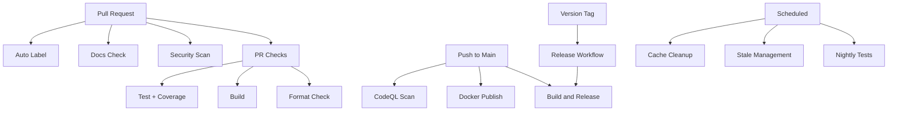

# GitHub Workflows Documentation

This directory contains automated workflows that help maintain code quality, security, and streamline the development process for the Market Data Collector project.

## 📋 Workflows Overview

### Build and Release Workflows

#### 1. **Build and Release** (`dotnet-desktop.yml`)
- **Trigger**: Push to `main`, Pull Requests, Git tags starting with `v*`
- **Purpose**: Main CI/CD pipeline that builds, tests, and publishes releases
- **Features**:
  - Builds on Ubuntu with .NET 9.0
  - Runs all tests with detailed logging
  - Multi-platform publishing (Linux, Windows, macOS x64/ARM64)
  - Creates GitHub releases for version tags
  - Generates single-file executables with trimming

#### 2. **Pull Request Checks** (`pr-checks.yml`)
- **Trigger**: Pull requests to `main` or `develop`
- **Purpose**: Validates code quality before merging
- **Features**:
  - Code formatting verification (`dotnet format`)
  - Build validation
  - Test execution with code coverage
  - Coverage reports uploaded to Codecov
  - Combined status reporting

#### 3. **Docker Publish** (`docker-publish.yml`)
- **Trigger**: Push to `main`, version tags, releases, manual dispatch
- **Purpose**: Builds and publishes Docker images to GitHub Container Registry
- **Features**:
  - Multi-platform builds (amd64, arm64)
  - Automatic tagging (latest, semver, sha)
  - Build cache optimization
  - Published to `ghcr.io`

#### 4. **Release Management** (`release.yml`)
- **Trigger**: Manual workflow dispatch
- **Purpose**: Streamlines creating new releases
- **Features**:
  - Semantic versioning validation
  - Automatic changelog generation
  - Git tag creation and push
  - GitHub release creation
  - Triggers build workflow automatically

### Code Quality Workflows

#### 5. **CodeQL Security Analysis** (`codeql.yml`)
- **Trigger**: Push to `main`, Pull Requests, Weekly schedule (Mondays 5 AM UTC)
- **Purpose**: Automated security vulnerability scanning
- **Features**:
  - Scans C# codebase for security issues
  - Uses GitHub's CodeQL engine
  - Security and quality queries
  - Results appear in GitHub Security tab

#### 6. **Security Scan** (`security-scan.yml`)
- **Trigger**: Push/PR to `main`, Weekly schedule (Tuesdays 3 AM UTC), Manual
- **Purpose**: Multi-layered security scanning
- **Features**:
  - Dependency review (on PRs)
  - Trivy filesystem vulnerability scanning
  - .NET package vulnerability checking
  - License compliance checking (blocks GPL-2.0, GPL-3.0)
  - Automated vulnerability reports

#### 7. **Benchmark Performance** (`benchmark.yml`)
- **Trigger**: Pull requests changing code, Manual dispatch
- **Purpose**: Performance regression detection
- **Features**:
  - Runs BenchmarkDotNet benchmarks
  - Compares PR vs base branch
  - Posts results as PR comment
  - Uploads detailed results as artifacts

### Testing Workflows

#### 8. **Nightly Testing** (`nightly.yml`)
- **Trigger**: Daily at 2 AM UTC, Manual dispatch
- **Purpose**: Comprehensive cross-platform testing
- **Features**:
  - Tests on Ubuntu, Windows, macOS
  - Runs full benchmark suite
  - Integration tests with self-tests
  - Creates issue on failure
  - Multi-platform coverage reports

### Documentation Workflows

#### 9. **Documentation Quality Check** (`docs-check.yml`)
- **Trigger**: Pull requests changing documentation or Markdown files
- **Purpose**: Ensures documentation quality
- **Features**:
  - Markdown linting (markdownlint-cli2)
  - Link checking (validates all links)
  - Spell checking
  - Only checks modified files in PRs

### Automation Workflows

#### 10. **Auto Label PRs** (`auto-label.yml`)
- **Trigger**: PR opened, edited, synchronized, reopened
- **Purpose**: Automatically categorizes pull requests
- **Features**:
  - File-based labeling (area labels)
  - Size-based labeling (xs/s/m/l/xl)
  - Warns about large PRs
  - Uses `.github/labeler.yml` configuration

#### 11. **Manage Stale Issues and PRs** (`stale.yml`)
- **Trigger**: Daily at midnight UTC, Manual dispatch
- **Purpose**: Keeps issue tracker clean
- **Features**:
  - Marks issues stale after 60 days
  - Closes stale issues after 7 more days
  - Marks PRs stale after 45 days
  - Closes stale PRs after 14 more days
  - Exempts pinned, security, and WIP items

#### 12. **Cache Management** (`cache-management.yml`)
- **Trigger**: Weekly (Sundays 4 AM UTC), Manual dispatch
- **Purpose**: Manages GitHub Actions cache
- **Features**:
  - Lists all caches
  - Cleans caches older than 30 days
  - Manual option to clean all caches
  - Helps manage storage limits

## 🔧 Configuration Files

### Dependabot Configuration (`dependabot.yml`)
Automated dependency updates for:
- **NuGet packages**: Weekly on Mondays
- **GitHub Actions**: Weekly on Mondays
- **Docker base images**: Weekly on Mondays

Groups minor and patch updates together to reduce PR noise.

### Auto-Labeler Configuration (`labeler.yml`)
Defines patterns for automatic labeling:
- **Area labels**: `area: core`, `area: providers`, `area: storage`, etc.
- **Type labels**: `documentation`, `tests`, `infrastructure`, etc.
- **Special categories**: Security-related changes

### Documentation Checking
- **`markdown-link-check-config.json`**: Configures link validation
- **`spellcheck-config.yml`**: Spell-checking configuration

## 📝 Issue Templates

### Bug Report (`ISSUE_TEMPLATE/bug_report.yml`)
Structured form for reporting bugs with fields for:
- Description and reproduction steps
- Expected vs actual behavior
- Version and OS information
- Data provider context
- Logs and configuration

### Feature Request (`ISSUE_TEMPLATE/feature_request.yml`)
Structured form for suggesting features:
- Problem statement
- Proposed solution and alternatives
- Feature area and priority
- Use case description

### Configuration (`ISSUE_TEMPLATE/config.yml`)
- Disables blank issues
- Links to documentation and discussions

## 📄 Pull Request Template

**`PULL_REQUEST_TEMPLATE.md`**
Standard template requiring:
- Change description and type
- Motivation and testing details
- Comprehensive checklist
- Breaking changes documentation
- Related issue links

## 🚀 Usage Tips

### For Developers

1. **Before Opening a PR**:
   ```bash
   # Format code locally
   dotnet format MarketDataCollector.sln
   
   # Run tests
   dotnet test
   ```

2. **Triggering Workflows Manually**:
   - Go to Actions tab
   - Select workflow
   - Click "Run workflow"

3. **Understanding PR Status Checks**:
   - ✅ All checks must pass before merge
   - Review any security warnings from CodeQL
   - Check code coverage reports

### For Maintainers

1. **Creating a Release**:
   - Use "Release Management" workflow
   - Provide semantic version (e.g., `v1.6.0`)
   - Mark as pre-release if needed
   - Workflow handles tagging and triggering builds

2. **Security Monitoring**:
   - Check Security tab regularly
   - Review Dependabot PRs promptly
   - CodeQL runs automatically on schedule

3. **Managing Stale Items**:
   - Workflow runs automatically
   - Exempt important items with labels
   - Review and respond to stale warnings

## 🔒 Security Features

- **CodeQL**: Advanced security scanning with security-and-quality queries
- **Trivy**: Container and filesystem vulnerability scanning
- **Dependency Review**: Blocks PRs with vulnerable or prohibited dependencies
- **Package Audit**: Scans for vulnerable NuGet packages
- **License Compliance**: Prevents GPL-licensed dependencies

## 📊 Metrics and Monitoring

- **Code Coverage**: Uploaded to Codecov on every PR and nightly
- **Benchmarks**: Performance tracking with historical comparison
- **Security Alerts**: Automated issue creation on nightly test failures
- **Artifact Retention**: 30 days for builds, benchmarks, and reports

## 🔄 Workflow Dependencies



## 📚 Best Practices

1. **Keep workflows fast**: Use caching and parallel jobs
2. **Fail fast**: Critical checks should fail quickly
3. **Clear feedback**: Provide actionable error messages
4. **Security first**: All code changes go through multiple security scans
5. **Automated maintenance**: Let workflows handle routine tasks
6. **Documentation**: Keep this README updated with workflow changes

## 🛠️ Maintenance

### Adding a New Workflow

1. Create workflow file in `.github/workflows/`
2. Test with `workflow_dispatch` trigger first
3. Update this README with workflow documentation
4. Add to workflow dependencies diagram if applicable

### Modifying Existing Workflows

1. Test changes in a feature branch
2. Review workflow run logs for issues
3. Update documentation if behavior changes
4. Consider backward compatibility

### Debugging Workflows

1. Enable debug logging:
   ```yaml
   env:
     ACTIONS_RUNNER_DEBUG: true
     ACTIONS_STEP_DEBUG: true
   ```

2. Use workflow artifacts for debugging
3. Check workflow run logs in Actions tab
4. Test locally with `act` tool when possible

## 📞 Support

- **Issues**: Report workflow problems using bug report template
- **Documentation**: Refer to `.github/workflows/README.md` (this file)
- **GitHub Actions Docs**: https://docs.github.com/en/actions

---

**Last Updated**: 2026-01-31
**Maintained By**: Market Data Collector Team
