# GitHub Workflows Documentation

This directory contains automated workflows that help maintain code quality, security, and streamline the development process for the Market Data Collector project.

## Consolidation Summary

Workflows have been consolidated from 25 to 19 files, reducing duplication and adding AI-powered analysis throughout. The following merges were performed:

| Consolidated Workflow | Replaces | AI Features |
|----------------------|----------|-------------|
| `documentation.yml` | `docs-comprehensive.yml`, `docs-auto-update.yml`, `docs-structure-sync.yml`, `ai-instructions-sync.yml`, `todo-automation.yml` | AI documentation quality review, AI TODO triage |
| `desktop-builds.yml` | `desktop-app.yml`, `wpf-desktop.yml`, `wpf-commands.yml` | AI build failure diagnosis |
| `security.yml` | absorbed `dependency-review.yml` | AI vulnerability assessment |
| `scheduled-maintenance.yml` | absorbed `cache-management.yml` | AI dependency upgrade recommendations |
| `pr-checks.yml` | (enhanced) | AI PR review summary |
| `nightly.yml` | (enhanced) | AI failure diagnosis |
| `code-quality.yml` | (enhanced) | AI code quality suggestions |

## Workflows Overview

### Build and Release Workflows

#### 1. **Build and Release** (`dotnet-desktop.yml`)
- **Trigger**: Manual workflow dispatch
- **Purpose**: Builds, tests, and publishes multi-platform releases on demand
- **Features**:
  - Builds on Ubuntu with .NET 9.0
  - Runs the full test suite
  - Multi-platform publishing (Linux, Windows, macOS x64/ARM64)
  - Prepares artifacts for release distribution

#### 2. **Pull Request Checks** (`pr-checks.yml`)
- **Trigger**: Pull requests to `main` or `develop`
- **Purpose**: Validates code quality before merging
- **Features**:
  - Code formatting verification (`dotnet format`)
  - Build validation
  - Test execution with code coverage
  - Coverage reports uploaded to Codecov
  - Combined status reporting
  - **AI**: PR review summary with risk assessment, focus areas, and potential issues

#### 3. **Docker Build & Publish** (`docker.yml`)
- **Trigger**: Manual workflow dispatch
- **Purpose**: Builds multi-arch Docker images and optionally pushes to GHCR
- **Features**:
  - Multi-platform builds (amd64, arm64)
  - Automatic tagging (latest, semver, sha)
  - Build cache optimization
  - Optional registry push based on input

#### 4. **Release Management** (`release.yml`)
- **Trigger**: Manual workflow dispatch
- **Purpose**: Streamlines creating new releases
- **Features**:
  - Semantic versioning validation
  - Automatic changelog generation
  - Git tag creation and push
  - GitHub release creation
  - Triggers build workflow automatically

#### 5. **Desktop Builds** (`desktop-builds.yml`) *(consolidated)*
- **Trigger**: Push/PRs touching desktop app paths, Manual dispatch with build target selector
- **Purpose**: Builds UWP and WPF desktop applications
- **Replaces**: `desktop-app.yml`, `wpf-desktop.yml`, `wpf-commands.yml`
- **Features**:
  - UWP: Icon generation, x64/arm64 builds, MSIX packaging, testing, release
  - WPF: Self-contained and framework-dependent publishing for x64/arm64
  - WPF smoke test for startup validation
  - Selective build targeting (all/uwp/wpf/wpf-smoke-test)
  - **AI**: Build failure diagnosis on failure

### Code Quality and Security Workflows

#### 6. **Code Quality** (`code-quality.yml`)
- **Trigger**: Push/PRs that touch source, tests, or project files
- **Purpose**: Runs formatting, analyzers, and documentation checks in one pass
- **Features**:
  - Formatting verification
  - Analyzer-enabled build with documentation output
  - Summarized results in workflow summary
  - Creates Copilot task issues for quality problems
  - **AI**: Code quality suggestions with priority fixes, quick wins, and suppression candidates

#### 7. **Security Scan** (`security.yml`) *(consolidated)*
- **Trigger**: Pull requests to `main`, weekly schedule, manual dispatch
- **Purpose**: Multi-layered security scanning
- **Absorbed**: `dependency-review.yml`
- **Features**:
  - .NET package vulnerability checks
  - Secret detection with Gitleaks
  - SAST build analysis
  - CodeQL analysis on schedule or manual full scan
  - Dependency review with license compliance (GPL deny list)
  - **AI**: Vulnerability assessment with risk analysis and remediation priorities

### Testing Workflows

#### 8. **Test Matrix** (`test-matrix.yml`)
- **Trigger**: Push/PRs that touch source or tests
- **Purpose**: Runs cross-platform tests with coverage reporting
- **Features**:
  - Linux tests on PRs
  - Windows/macOS tests on pushes to `main`
  - Coverage uploaded to Codecov

#### 9. **Nightly Testing** (`nightly.yml`)
- **Trigger**: Daily schedule (1 AM UTC), Manual dispatch
- **Purpose**: Comprehensive cross-platform testing
- **Features**:
  - Tests on Ubuntu, Windows, macOS
  - Runs benchmark suite
  - Integration self-tests
  - Creates issue on failure
  - Multi-platform coverage reports
  - **AI**: Failure diagnosis with root cause analysis and triage priority

#### 10. **Benchmark Performance** (`benchmark.yml`)
- **Trigger**: Manual workflow dispatch (with optional benchmark filter)
- **Purpose**: Performance regression detection
- **Features**:
  - Runs BenchmarkDotNet benchmarks
  - Optional filter for specific benchmark classes
  - Uploads detailed results as artifacts

### Documentation Workflows

#### 11. **Documentation** (`documentation.yml`) *(consolidated)*
- **Trigger**: Push/PRs touching docs/workflows/source, weekly schedule (Mondays 3 AM UTC), issues with `ai-known-error` label, manual dispatch
- **Purpose**: Centralized documentation quality checks, generation, AI instruction sync, and TODO tracking
- **Replaces**: `docs-comprehensive.yml`, `docs-auto-update.yml`, `docs-structure-sync.yml`, `ai-instructions-sync.yml`, `todo-automation.yml`
- **Multi-trigger Design**: This workflow uses multiple triggers and conditionals to handle different automation tasks:
  - **Issues trigger**: Only runs `ai-known-errors-intake` job when an issue is labeled with `ai-known-error`
  - **Push/PR/Schedule triggers**: Runs documentation generation, validation, and TODO scanning jobs
  - Jobs show as "skipped" when their trigger conditions aren't met (this is expected GitHub Actions behavior)
- **Features**:
  - AI known errors intake from labeled GitHub issues
  - Change detection across 10 categories (source, providers, docs, workflows, etc.)
  - Markdown linting and link validation
  - Regenerates structure, provider registry, workflow, project context, ADR, and config schema docs
  - AI instruction sync for CLAUDE.md, Copilot instructions, and documentation agent
  - TODO/FIXME/HACK/NOTE comment scanning with documentation generation
  - Optional GitHub issue creation for untracked TODOs
  - **AI**: Documentation quality review, TODO triage recommendations

#### 12. **Update Diagram Artifacts** (`update-diagrams.yml`)
- **Trigger**: Push to `main` touching `docs/diagrams/*.dot` files, manual dispatch
- **Purpose**: Automatically regenerates PNG and SVG diagram artifacts from DOT source files
- **Features**:
  - Installs Graphviz for diagram generation
  - Converts all DOT files to PNG and SVG formats
  - Auto-commits regenerated artifacts to keep them in sync with sources
  - Prevents manual diagram artifact editing drift

### Automation and Maintenance Workflows

#### 13. **Auto Label PRs** (`labeling.yml`)
- **Trigger**: PR opened, edited, synchronized, reopened
- **Purpose**: Automatically categorizes pull requests
- **Features**:
  - File-based labeling (area labels)
  - Size-based labeling (xs/s/m/l/xl)
  - Warns about large PRs
  - Uses `.github/labeler.yml` configuration

#### 14. **Manage Stale Issues and PRs** (`stale.yml`)
- **Trigger**: Daily at midnight UTC, Manual dispatch
- **Purpose**: Keeps issue tracker clean
- **Features**:
  - Marks issues stale after 60 days
  - Closes stale issues after 7 more days
  - Marks PRs stale after 30 days
  - Closes stale PRs after 14 more days
  - Exempts pinned, security, and WIP items

#### 15. **Scheduled Maintenance** (`scheduled-maintenance.yml`) *(consolidated)*
- **Trigger**: Weekly schedule, Manual dispatch
- **Purpose**: Runs periodic tests, dependency health checks, and cache management
- **Absorbed**: `cache-management.yml`
- **Features**:
  - Weekly full test suite
  - Dependency health report (outdated, deprecated, vulnerable)
  - GitHub Actions cache listing and cleanup (30+ day old caches)
  - Manual cache management options (list/clean-old/clean-all)
  - **AI**: Dependency upgrade recommendations with risk assessment

#### 16. **Build Observability** (`build-observability.yml`)
- **Trigger**: Manual workflow dispatch
- **Purpose**: Generates build diagnostics and observability bundles
- **Features**:
  - Runs build diagnostics targets
  - Collects build fingerprints and metrics
  - Uploads debug artifacts

#### 17. **Workflow Validation** (`validate-workflows.yml`)
- **Trigger**: Pull requests touching workflows or manual dispatch
- **Purpose**: Validates workflow syntax and checks reusable references
- **Features**:
  - Ensures workflow YAML consistency
  - Validates issue template YAML files
  - Validates AI assistant prompt YAML files
  - Catches invalid reusable workflow usage
  - Fast feedback for workflow edits

#### 18. **Prompt Generation** (`prompt-generation.yml`)
- **Trigger**: Manual dispatch with workflow name input, automatic after workflow failures
- **Purpose**: Auto-generates AI assistant prompts from CI/CD workflow run analysis
- **Features**:
  - Analyzes workflow run failures and patterns
  - Generates targeted `.prompt.yml` files in `.github/prompts/`
  - Supports dry-run mode for preview
  - Creates PR with generated prompts or commits directly
  - Monitors Test Matrix, Code Quality, Security Scanning, Performance Benchmarks, and Docker Build workflows
  - **AI**: Prompt quality review and improvement suggestions

### Shared Workflows

#### 19. **Reusable Build Helpers** (`reusable-dotnet-build.yml`)
- **Trigger**: Reusable workflow (called by other workflows)
- **Purpose**: Standardizes build/test steps for .NET jobs
- **Features**:
  - Shared build/test steps
  - Consistent caching and restore behavior

## Configuration Files

### Dependabot Configuration (`dependabot.yml`)
Automated dependency updates for:
- **NuGet packages**: Weekly on Mondays
- **GitHub Actions**: Weekly on Mondays
- **Docker base images**: Weekly on Mondays

Groups minor and patch updates together to reduce PR noise.

### Auto-Labeler Configuration (`labeler.yml`)
Defines patterns for automatic labeling:
- **Area labels**: `area: core`, `area: providers`, `area: storage`, etc.
- **Type labels**: `documentation`, `tests`, `infrastructure`, etc.
- **Special categories**: Security-related changes

### Documentation Checking
- **`markdown-link-check-config.json`**: Configures link validation
- **`spellcheck-config.yml`**: Spell-checking configuration

## Issue Templates

### Bug Report (`ISSUE_TEMPLATE/bug_report.yml`)
Structured form for reporting bugs with fields for:
- Description and reproduction steps
- Expected vs actual behavior
- Version and OS information
- Data provider context
- Logs and configuration

### Feature Request (`ISSUE_TEMPLATE/feature_request.yml`)
Structured form for suggesting features:
- Problem statement
- Proposed solution and alternatives
- Feature area and priority
- Use case description

### Configuration (`ISSUE_TEMPLATE/config.yml`)
- Disables blank issues
- Links to documentation and discussions

## Pull Request Template

**`PULL_REQUEST_TEMPLATE.md`**
Standard template requiring:
- Change description and type
- Motivation and testing details
- Comprehensive checklist
- Breaking changes documentation
- Related issue links

## AI Integration

All AI-powered features use `actions/ai-inference@v1` with `openai/gpt-4o-mini` and are configured with `continue-on-error: true` so AI failures never block workflows. AI features include:

| Workflow | AI Feature | Purpose |
|----------|-----------|---------|
| `pr-checks.yml` | PR Review | Risk assessment and review focus areas |
| `code-quality.yml` | Quality Suggestions | Priority fixes and suppression candidates |
| `security.yml` | Vulnerability Assessment | Risk analysis and remediation priorities |
| `nightly.yml` | Failure Diagnosis | Root cause analysis and triage priority |
| `scheduled-maintenance.yml` | Dependency Analysis | Upgrade recommendations with risk assessment |
| `documentation.yml` | Doc Quality Review, TODO Triage | Completeness/accuracy assessment, TODO prioritization |
| `desktop-builds.yml` | Build Analysis | Common failure pattern diagnosis |
| `prompt-generation.yml` | Prompt Quality Review | Improvement suggestions for auto-generated prompts |

## Workflow Dependencies

```mermaid
graph TD
    PR[Pull Request] --> PRChecks[PR Checks + AI Review]
    PR --> CodeQuality[Code Quality + AI]
    PR --> Security[Security + Dep Review + AI]
    PR --> Docs[Documentation + AI]
    PR --> AutoLabel[Auto Label]
    PR --> Validate[Validate Workflows]

    PRChecks --> Lint[Format Check]
    PRChecks --> Build[Build]
    PRChecks --> Test[Test + Coverage]

    Push[Push to Main] --> TestMatrix[Test Matrix]
    Push --> CodeQuality
    Push --> Docs

    Schedule[Scheduled] --> Nightly[Nightly Tests + AI]
    Schedule --> Stale[Stale Management]
    Schedule --> Maintenance[Maintenance + Cache + AI]

    Manual[Manual Dispatch] --> BuildRelease[Build and Release]
    Manual --> Docker[Docker Build]
    Manual --> Desktop[Desktop Builds + AI]
    Manual --> Observability[Build Observability]
    Manual --> Release[Release Workflow]
```



## Usage Tips

### For Developers

1. **Before Opening a PR**:
   ```bash
   # Format code locally
   dotnet format MarketDataCollector.sln

   # Run tests
   dotnet test
   ```

2. **Triggering Workflows Manually**:
   - Go to Actions tab
   - Select workflow
   - Click "Run workflow"

3. **Understanding PR Status Checks**:
   - All checks must pass before merge
   - Review AI-generated PR review summary for risk assessment
   - Review dependency review and security scan summaries
   - Check code coverage reports in Codecov uploads

### For Maintainers

1. **Creating a Release**:
   - Use "Release Management" workflow
   - Provide semantic version (e.g., `v1.6.0`)
   - Mark as pre-release if needed
   - Workflow handles tagging and triggering builds

2. **Security Monitoring**:
   - Check Security tab regularly
   - Review Dependabot PRs promptly
   - CodeQL runs on the weekly security schedule or manual full scans
   - Review AI vulnerability assessments in workflow summaries

3. **Managing Stale Items**:
   - Workflow runs automatically
   - Exempt important items with labels
   - Review and respond to stale warnings

## Best Practices

1. **Keep workflows fast**: Use caching and parallel jobs
2. **Fail fast**: Critical checks should fail quickly
3. **Clear feedback**: Provide actionable error messages
4. **Security first**: All code changes go through multiple security scans
5. **AI-assisted**: AI analysis supplements but never blocks workflows
6. **Automated maintenance**: Let workflows handle routine tasks
7. **Documentation**: Keep this README updated with workflow changes

## Maintenance

### Adding a New Workflow

1. Create workflow file in `.github/workflows/`
2. Test with `workflow_dispatch` trigger first
3. Consider adding AI analysis using `actions/ai-inference@v1`
4. Update this README with workflow documentation
5. Add to workflow dependencies diagram if applicable

### Modifying Existing Workflows

1. Test changes in a feature branch
2. Review workflow run logs for issues
3. Update documentation if behavior changes
4. Consider backward compatibility

### Debugging Workflows

1. Enable debug logging:
   ```yaml
   env:
     ACTIONS_RUNNER_DEBUG: true
     ACTIONS_STEP_DEBUG: true
   ```

2. Use workflow artifacts for debugging
3. Check workflow run logs in Actions tab
4. Test locally with `act` tool when possible

## Support

- **Issues**: Report workflow problems using bug report template
- **Documentation**: Refer to `.github/workflows/README.md` (this file)
- **GitHub Actions Docs**: https://docs.github.com/en/actions

---

**Last Updated**: 2026-02-06
**Maintained By**: Market Data Collector Team
