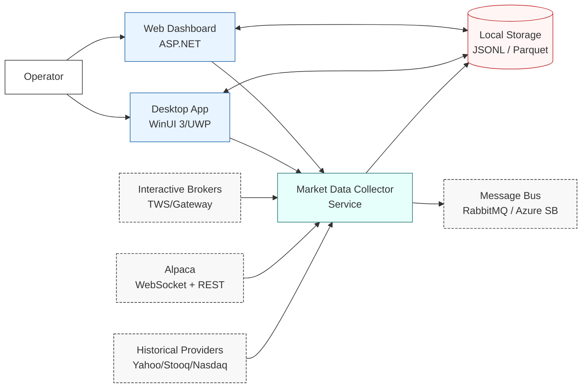
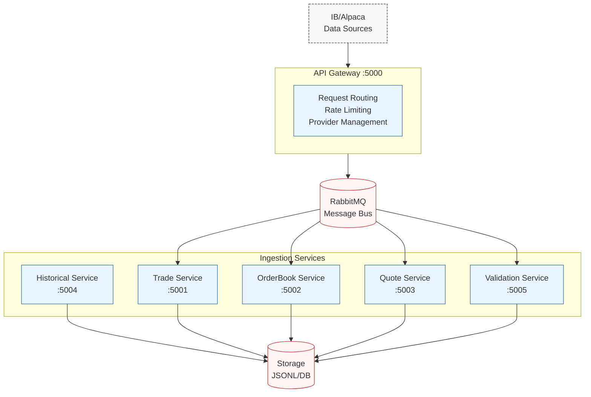

# C4 Diagrams

## Rendered exports (SVG/PNG)

These are pre-rendered exports for environments that don't support Mermaid rendering.

- Level 1: System Context
  - SVG: `docs/diagrams/c4-level1-context.svg`
  - PNG: `docs/diagrams/c4-level1-context.png`

- Level 2: Containers
  - SVG: `docs/diagrams/c4-level2-containers.svg`
  - PNG: `docs/diagrams/c4-level2-containers.png`

- Level 3: Components
  - SVG: `docs/diagrams/c4-level3-components.svg`
  - PNG: `docs/diagrams/c4-level3-components.png`

---

These diagrams describe the system using the C4 model:
- **Level 1**: System Context
- **Level 2**: Container Diagram
- **Level 3**: Component Diagram (Collector runtime)

> Notes:
> - Mermaid diagrams render on GitHub and in many markdown viewers.
> - For DocFX, Mermaid rendering depends on theme/extension. If Mermaid isn't rendered, treat these as source diagrams and export to SVG/PNG later.
> - Diagrams include multiple data provider feeds and the `QuoteCollector` that emits BBO events used for aggressor inference.

---

## Level 1 — System Context (C4)



---

## Level 2 — Containers (C4)

```mermaid
flowchart TB
    subgraph C[Market Data Collector (Process)]
        APP[Application Layer\nProgram/ConfigWatcher/StatusWriter/BackfillService]:::container
        DOM[Domain Layer\nCollectors + Models]:::container
        PIPE[Event Pipeline\nEventPipeline/Bounded Channel]:::container
        MSG[Messaging\nMassTransit/CompositePublisher]:::container
        STOR[Storage\nJsonl/Parquet Sinks]:::container
        INFRA[Infrastructure\nStreaming + Historical Providers]:::container
    end

    IB[Interactive Brokers\nTWS/Gateway]:::ext
    ALP[Alpaca\nWebSocket + REST]:::ext
    HIST[Historical APIs\nYahoo/Stooq/Nasdaq]:::ext
    DISK[(Filesystem\n./data)]:::store
    MQ[(Message Bus\nRabbitMQ)]:::store
    UI[Web Dashboard\nMarketDataCollector.Ui]:::container
    UWP[Desktop App\nMarketDataCollector.Uwp]:::container
    OPR[Operator]:::person

    OPR --> UI
    OPR --> UWP
    UI <--> DISK
    UWP <--> DISK

    IB --> INFRA
    ALP --> INFRA
    HIST --> INFRA
    INFRA --> DOM
    DOM --> PIPE
    PIPE --> STOR
    PIPE --> MSG
    STOR --> DISK
    MSG --> MQ

    APP --> INFRA
    APP --> DOM
    APP --> PIPE
    APP --> STOR

classDef person fill:#fff,stroke:#333,stroke-width:1px;
classDef ext fill:#f8f8f8,stroke:#333,stroke-dasharray: 4 2;
classDef container fill:#e8f4ff,stroke:#2b6cb0,stroke-width:1px;
classDef store fill:#fff5f5,stroke:#c53030,stroke-width:1px;
```

---

## Level 3 — Components (Collector Runtime)

```mermaid
flowchart LR
    subgraph INF[Infrastructure/Providers]
        CONN[EnhancedIBConnectionManager\n(EWrapper)]:::component
        ROUTE[IBCallbackRouter]:::component
        FACT[ContractFactory]:::component
        CLIENT[IMarketDataClient\nIBMarketDataClient/AlpacaMarketDataClient/NoOp]:::component
    end

    subgraph DOM[Domain]
        TD[TradeDataCollector]:::component
        MD[MarketDepthCollector]:::component
        QC[QuoteCollector\n(BBO cache/emitter)]:::component
        MODELS[Models\nTrade/LOBSnapshot/BboQuotePayload/Integrity]:::component
    end

    subgraph APP[Application]
        CW[ConfigWatcher]:::component
        SW[StatusWriter]:::component
        MET[Metrics]:::component
    end

    subgraph PIPE[Pipeline/Storage]
        EP[EventPipeline\nBounded Channel]:::component
        SINK[JsonlStorageSink]:::component
        POL[JsonlStoragePolicy]:::component
        FS[(Filesystem)]:::store
    end

    IB[IB TWS/Gateway]:::ext
    ALP[Alpaca WebSocket]:::ext

    IB --> CONN --> ROUTE
    ALP --> CLIENT
    ROUTE --> TD
    ROUTE --> MD
    ROUTE --> QC
    CLIENT --> TD
    CLIENT --> QC
    TD --> EP
    MD --> EP
    QC --> EP
    QC --> TD
    EP --> SINK --> FS
    POL --> SINK

    CW --> APP
    SW --> FS
    MET --> APP

    CLIENT --> FACT
    CLIENT --> CONN

classDef ext fill:#f8f8f8,stroke:#333,stroke-dasharray: 4 2;
classDef component fill:#f7fafc,stroke:#4a5568,stroke-width:1px;
classDef store fill:#fff5f5,stroke:#c53030,stroke-width:1px;
```

---

## Level 4 — Microservices Architecture (Optional Deployment)

For high-throughput scenarios, the system can be deployed as microservices:



### Microservices Summary

| Service | Port | Purpose |
|---------|------|---------|
| Gateway | 5000 | Entry point, routing, rate limiting |
| Trade | 5001 | Tick-by-tick trade processing |
| OrderBook | 5002 | L2 order book maintenance |
| Quote | 5003 | BBO/NBBO quote processing |
| Historical | 5004 | Historical data backfill |
| Validation | 5005 | Data quality and alerting |

See [Microservices README](../src/Microservices/README.md) for deployment details.

---

**Version:** 1.4.0
**Last Updated:** 2026-01-04
**See Also:** [Architecture Overview](overview.md) | [Domains](domains.md) | [Why This Architecture](why-this-architecture.md) | [Microservices README](../../src/Microservices/README.md)
